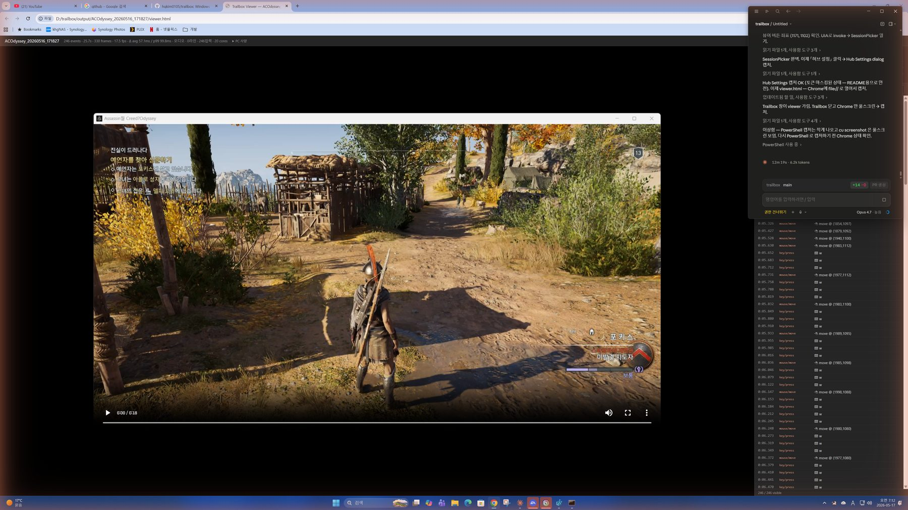
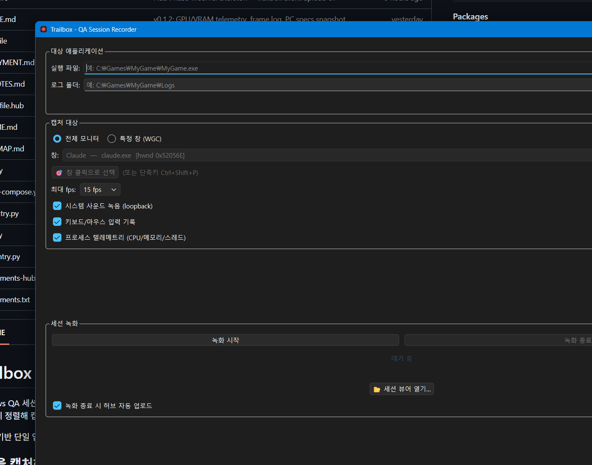
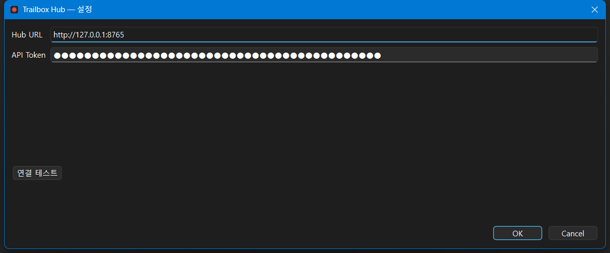
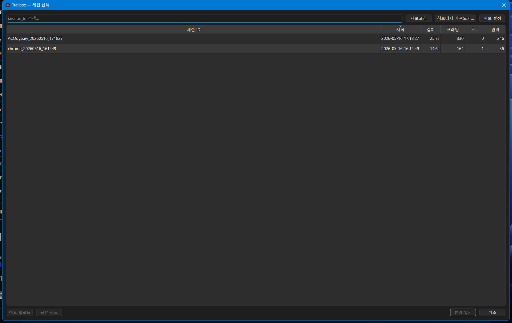

# Trailbox

Windows QA 세션 레코더. **화면 · 시스템 사운드 · 게임 로그 · 키마 입력 · CPU/GPU/RAM 텔레메트리** 를 한 번에 녹화해서 브라우저에서 통합 뷰어로 확인하고, 팀과 링크로 공유합니다.


*세션 뷰어 — 영상 / 차트 / 입력·로그 타임라인이 같은 시간축으로 정렬됨*

---

## 받기

[**Releases 최신**](https://github.com/hgkim0105/trailbox/releases/latest) 에서 **`Trailbox-Setup.exe`** (~212 MB) 받아 더블클릭.

설치 마법사가 셋업 종류 (Full / Client / GUI-only / Custom) 와 Hub 연결 정보를 물어보고 알아서 잡아 줍니다. **Python · ffmpeg · 그 외 의존성 모두 .exe 안에 포함** — 별도 설치 불필요.

> 분리된 `Trailbox.exe` / `Trailbox-mcp.exe` / `Trailbox-hub.exe` 도 같은 페이지에 있음. 인스톨러 안 쓰고 수동 배치할 때만.

요구사항: **Windows 10 1903+** (Windows 11 권장)

---

## 첫 사용

설치 후 시작 메뉴 「Trailbox」 더블클릭.



1. **캡처 대상** — 「전체 모니터」 또는 「특정 창 (WGC)」. 창은 콤보박스에서 고르거나, 「🎯 창 클릭으로 선택」 또는 게임 풀스크린 안에서 `Ctrl+Shift+P` 단축키로 잡을 수 있음
2. (선택) **실행 파일** + **로그 폴더** — 둘 중 하나만 입력해도 다른 쪽을 자동 추론. 게임 자체가 디스크에 로그를 안 남기면 (AC Odyssey 등) 런처 로그가 잡힙니다
3. **녹화 시작** → 작업 진행 → **녹화 종료**
4. **📂 세션 뷰어 열기…** → 목록에서 골라 더블클릭 → 기본 브라우저로 통합 뷰어 열림

녹화 결과는 `output/{session_id}/` 폴더에 저장. **다른 PC 로 폴더 통째 압축해 보내도 viewer.html 더블클릭으로 그대로 재생** 됩니다 (자체완결 HTML).

---

## 팀 공유 — Trailbox Hub

Hub 는 옵션입니다. 안 깔아도 위 기능 다 동작. 다음 시나리오면 켜세요:

| 원하는 것 | Hub 없이 | Hub 로 |
|---|---|---|
| 다른 사람에게 세션 보여주기 | 폴더 압축해서 메신저로 전송 → 받은 사람이 풀고 viewer.html 열기 | 「공유 링크」 클릭 → URL 한 줄 보내기 |
| 자동 백업 | 수동 | 녹화 종료 시 자동 업로드 + N일 만료 정책 |
| AI 가 원격 세션 분석 | 불가 (로컬 파일만) | Claude Desktop 의 MCP 가 원격 세션 조회 |

### 셋업 (같은 PC, LAN-only)

인스톨러에서 **Full** 선택 + **Hub Configuration** 페이지의 **Generate** 버튼 → 자동으로 토큰 생성 + 레지스트리 + `start-hub.bat` 모두 채워짐.

설치 끝나면 시작 메뉴 **「Trailbox Hub」** 한 번 실행 (콘솔 창 유지). Trailbox 의 「허브 설정」 다이얼로그는 이미 자동 입력됨.



### 팀원 (다른 PC) 추가

1. Admin 이 자기 PC 의 `hub-token.txt` 또는 클립보드의 토큰을 메신저로 전달
2. 팀원은 인스톨러에서 **Client only** 선택 + Hub Configuration 페이지에 admin URL + 토큰 붙여넣기
3. 끝 — 첫 실행에 자동으로 Hub 연결됨

### 세션 공유 흐름



- **허브 업로드** — 선택한 로컬 세션을 Hub 로 올림
- **공유 링크** — Hub 의 세션에 공유 토큰 발급 → URL 자동 클립보드 복사. 받는 사람은 Trailbox 미설치라도 브라우저로 viewer 그대로 봄
- **허브에서 가져오기…** — 다른 사람이 올린 Hub 세션을 로컬로 다운로드

원격 호스팅 / Docker / HTTPS 셋업은 → [DEPLOYMENT.md](DEPLOYMENT.md)

---

## AI 분석 (Claude Desktop)

Trailbox MCP 가 설치되어 있으면 Claude Desktop 에 등록할 수 있습니다.

`%APPDATA%\Claude\claude_desktop_config.json` 편집:

```json
{
  "mcpServers": {
    "trailbox": {
      "command": "C:\\Program Files\\Trailbox\\Trailbox-mcp.exe",
      "env": {
        "TRAILBOX_HUB_URL": "http://127.0.0.1:8765",
        "TRAILBOX_HUB_TOKEN": "<인스톨러에서-받은-토큰>"
      }
    }
  }
}
```

> `env` 블록을 빼면 로컬 `output/` 폴더만 봄 (Hub 미사용 모드).

Claude Desktop 재시작 후 채팅에서 활용:

- "최근 세션에서 CPU 50% 넘긴 구간 알려줘"
- "이 세션 12~15초 사이에 무슨 입력이 있었나"
- "logs 에서 'error' 들어간 라인만 영상 타임코드와 같이 보여줘"
- "5번째 마우스 클릭 시점에 화면이 어땠어?" (영상 프레임을 JPEG 로 추출해 보여줌)

7개 도구 (list_sessions / get_session / query_events / get_metrics / search_logs / get_frame_at / get_viewer_path) 가 자동 인식됩니다.

---

## 통합 뷰어 (`viewer.html`)

세션 종료 시 자동 생성되는 단일 HTML 파일. 폴더에서 더블클릭하면 기본 브라우저로 열림.

- **좌측**: HTML5 비디오 (mp4 + AAC 사운드)
- **우측 상단**: CPU / GPU / RSS / VRAM / fps 5라인 차트 + 영상 playhead 수직선
- **우측 중간**: logs + inputs 통합 타임라인 — 필터 / 검색 / 행 클릭 → 그 시점으로 점프
- **헤더**: 이벤트 카운트 / duration / frames / Δ avg/p99 / cores 등 한눈 요약
- **PC 사양 ▶**: OS / CPU / RAM / GPU / Display(해상도+scaling) / Python / Trailbox 버전

---

## 알려진 한계

- **DRM 보호 비디오** (Netflix 등): 영상은 검은 박스로 캡처됨 (OS 강제 보호). 사운드는 정상
- **Anti-cheat 게임**: 메모리 덤프류 차단. **텔레메트리는 차단되지 않음** (perf counter는 별도 경로)
- **풀스크린 Exclusive 게임**: 일부 타이틀은 백버퍼 접근 제한. Borderless 모드 권장
- **클로즈드 엔진 게임 로그**: AC Odyssey(Anvil), EA Frostbite 등은 디스크 로깅 없음 → 런처 로그만 잡힘. UE / Unity 게임은 `Saved/Logs` / `Player.log` 로 풍부

---

## 더 알아보기

- **[DEPLOYMENT.md](DEPLOYMENT.md)** — Hub 서버 배포 (단일 .exe / Docker / Caddy + Let's Encrypt)
- **[DEVELOPING.md](DEVELOPING.md)** — 소스 빌드 / 아키텍처 / JSONL 스키마 / REST API 전체 / 환경변수 / MCP 백엔드
- **[DEVNOTES.md](DEVNOTES.md)** — 개발 의사결정 기록
- **[ROADMAP.md](ROADMAP.md)** — 백로그

## 라이선스

MIT
